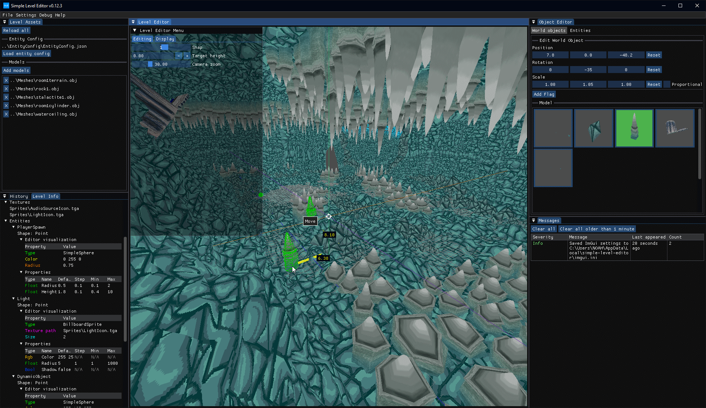

# Simple Level Editor

Simple cross-platform 3D level editor written in C# and F# using .NET 8, OpenGL and ImGui.

> Try the latest alpha version [here](https://github.com/NoahStolk/simple-level-editor/releases).

The GitHub releases only list Windows builds for now, but a Linux build can easily be made. You only need the .NET SDK (version 8.0) to compile the project.

There is also a NuGet package for reading level and entity config files: 

## Features

### Editor

- Easily build level geometry using 3D models
- Full undo/redo support
- Move, rotate, and scale world objects

### UI

- Built with the excellent [Dear ImGui](https://github.com/ocornut/imgui) library
- Docking support
- Customizable layout
- UI is saved between sessions

### Entity configuration

- Define your own entities using a JSON file

### Integration

- Save and load levels as JSON files
- Deserialize levels using the NuGet package
